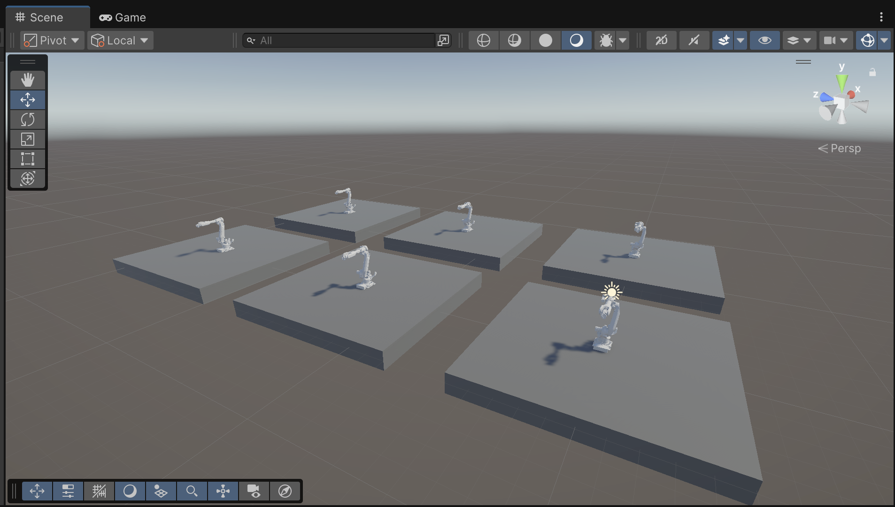

## Alive Arm Project

# Alive Arm  

This is a personal project developed to deepen my understanding of machine learning applied to robotics.  
I use Unity together with its dedicated ML-Agents toolkit.  

### Project Goal  
- Train a robotic arm to reach a target, starting with reaching a certain height.  
- Explore how the arm behaves in different environments, such as when the base is not fixed.  
- Apply machine learning to study and shape the interaction between machine and environment.  

### Notes  
This is a work in progress.

### Visual Snippet
 

Using prefabs, six learning agents are trained simultaneously. This setup works well as long as the time scale is moderate — avoid setting it too high (e.g., >15) to prevent instability.

### Key Features
- Robotic arm with realistic physics and a movable base
- Reinforcement learning via ML-Agents (PPO)
- Step-by-step learning pipeline: **Stand → Balance → Move**
- Modular Unity scene and C# architecture

### Tech Stack
- Unity Engine (60001.3f1)
- ML-Agents Toolkit (3.0.0)
- C# (for simulation logic)
- Python (training backend)

### How To
- Activate the conda environment
- Run: `mlagents-learn configs/arm_config.yaml --run-id=armx`
- Press **Play** in the Unity Editor to begin simulation

### Credits

This project uses 3D models from [Preliy/Flange](https://github.com/Preliy/Flange), licensed under the MIT License.
